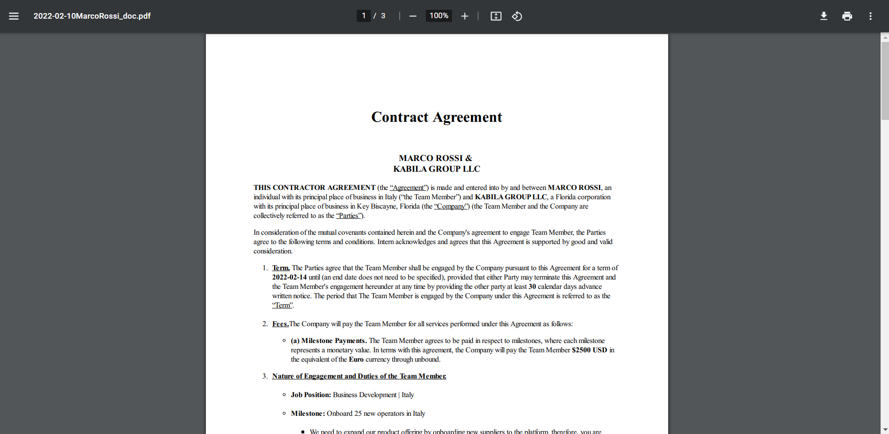
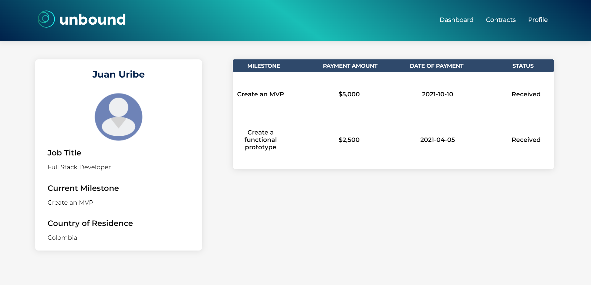

# unbound

unbound is a tech-enabled self-serve platform that helps entrepreneurs hire and manage top talent across borders through automated compliance and payroll management. As the work landscape continues to shift towards remote work, new companies will need tools to build their teams with a remote first approach, this platform was built to give entrepreneurs the tools they need to build remote teams. This is an MVP .

unbound-teams.com <- I took the url down 

The landing page of unbound

You are prompted to login if you have an account, or signup otherwise

Once signed in, the user is brought to the dashboard where all the team information is stored, and a birdseye view of all team members is available. If google maps marker is clicked, further information on the team member is depicted

The dashboard provides the user with essential information on the team members such as name, job title, location, country of residence, a link to download the employment contract, the preferred payment currency, the payment amount due after completion of the milestone, and a payment button

The user has the option to onboard a new team member by submitting a form that will autogenerate a contract. This information will then be displayed in the dashboard

Once the form is submitted, the contract is generated

From the dashboard page, the user can pay a team member by clicking the pay button (which has an awesome animation where money and credit cards pop out of the wallet, this can be seen in the fifth screenshot) which then takes the user to a stripe checkout page

Once the user has successfully paid the team member, the user is redirected to a page dedicated to that team member which provides information on all previous payments alongside other information relative to that team member

Finally, the user can sign out when finished using the application

## Installation

1) Clone the repository and open it on your source code editor
2) Install and setup mySQL if you have not already
    
    2.1) Add a database titled "unbound"

3) Install dependencies in the client and server directories
4) Create a .env and install all enviornmental variables using the .env.sample folder as a guide
5) Migrate the tables to your database
6) Use knex to seed the data into the database
7) You should be ready to go!
## Tech Stack

JS, ReactJS, NodeJS + Express, axios, mySQL, knexJS, Sass, bcrypt.js jsonwebtoken, various npm packages, stripe API & google maps API
## 🚀 About Me
I'm a full stack developer and looking for work!
https://www.linkedin.com/in/enriquebarco/
